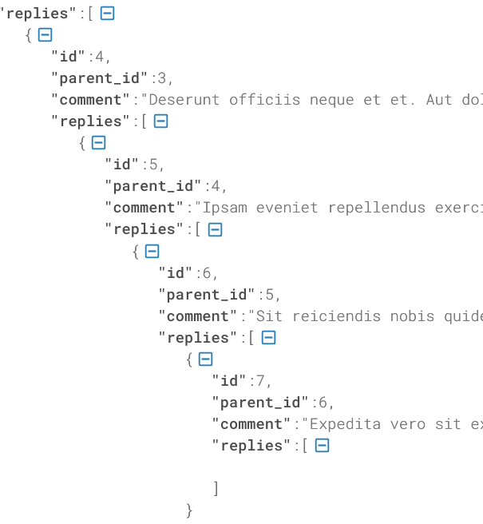

## Social Media Demo

A simple Laravel project .
Mainly focused on the multi level comments and mentions.

use the bellow command to seed demo data according the factory
```
php artisan mgrate:refresh --seed
```

Add some nested parent id for testing.

- /api/comments/index/{postID}
  <br />through the api we can check the nested comments.



- Mentions Part
    -
  - /api/comments/user/{data}'
    <br>using the api we can username by letter and store the selected name into an arrayList.
  - After that the users arrayList needs to send as a json array with the comment.
  

